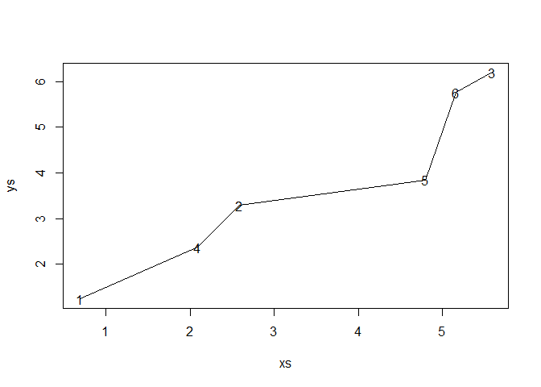
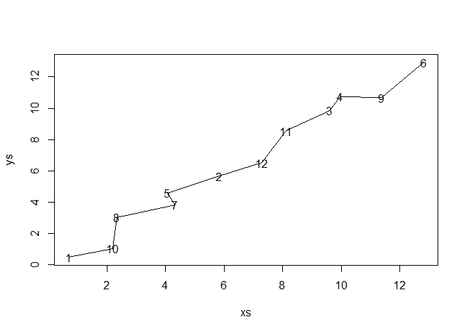
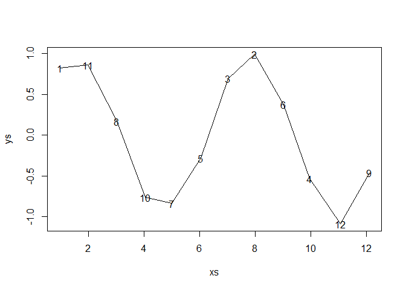

Synapse order along axon
================
Bindoff, A.
16 January 2018

``` r
n <- 6
tortuosity <- 1/2
axon <- generate_axon(n, tortuosity, sin = F)
```



``` r
# look at the adjacency matrix
(A <- adj_matrix(axon[[1L]]))
```

    ##      [,1]     [,2]     [,3]     [,4]     [,5]     [,6]
    ## [1,]   NA 2.787695 6.968055 1.800221 4.865996 6.357047
    ## [2,]   NA       NA 4.182866 1.041402 2.284991 3.572210
    ## [3,]   NA 4.182866       NA 5.183826 2.477653 0.611051
    ## [4,]   NA 1.041402 5.183826       NA 3.083239 4.573056
    ## [5,]   NA 2.284991 2.477653 3.083239       NA 1.943571
    ## [6,]   NA 3.572210 0.611051 4.573056 1.943571       NA

``` r
# compare with plot and table of observations -
axon[[1L]]
```

    ##           [,1]     [,2]
    ## [1,] 0.6867731 1.243715
    ## [2,] 2.5821857 3.287891
    ## [3,] 5.5897658 6.194922
    ## [4,] 2.0918217 2.369162
    ## [5,] 4.7976404 3.847306
    ## [6,] 5.1647539 5.755891

``` r
path <- path_finder(axon[[1L]])
path  ## check path has same sequence as plotted path
```

    ## [1] 1 4 2 5 6 3

``` r
all(path == axon[[2L]]) ## FALSE means at least one node is out of order
```

    ## [1] TRUE

#### Now increase `tortuosity` or `n` and see how bad it can get before it falls over!

``` r
n <- 12
tortuosity <- 3/4
axon <- generate_axon(n, tortuosity, sin = F)
```



``` r
path <- path_finder(axon[[1L]])
path  ## check path has same sequence as plotted path
```

    ##  [1]  1 10  8  7  5  2 12 11  3  4  9  6

``` r
all(path == axon[[2L]]) ## FALSE means at least one node is out of order
```

    ## [1] TRUE

#### Add some sinuosity

``` r
tortuosity <- 1/20
axon <- generate_axon(n, tortuosity, sin = T)
```



``` r
path <- path_finder(axon[[1L]])
path  ## check path has same sequence as plotted path
```

    ##  [1]  1 11  8 10  7  5  3  2  6  4 12  9

``` r
all(path == axon[[2L]]) ## FALSE means at least one node is out of order
```

    ## [1] TRUE
